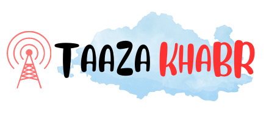

# TaazaKhabr News Portal

  https://monojmkd.github.io/taazakhabr-news/

TaazaKhabr is a news website portal that provides users with the latest and most up-to-date news and information from around the world. This repository contains the source code and assets for the TaazaKhabr website.

## Features

- **Fresh News**: TaazaKhabr delivers real-time news updates to keep users informed about current events as they happen.

- **User-Friendly Interface**: The website offers an intuitive and user-friendly interface to navigate through different news categories.

- **Categories and Tags**: News articles are categorized and tagged for easy exploration and discovery of specific topics.

- **Responsive Design**: TaazaKhabr is designed to work seamlessly across various devices, including desktops, tablets, and mobile phones.

## Technologies Used

- ReactJS: The front-end is built using ReactJS, allowing for a modular and component-based structure.

- HTML5, CSS3: For the front-end structure and presentation.

- JavaScript: For interactive elements and dynamic content.

- Bootstrap: To ensure a responsive and mobile-friendly layout.

## API

TaazaKhabr fetches news articles from the [Inshorts API](https://docs.inshorts.me/), which provides concise and comprehensive news summaries in a variety of categories.

## Setup Instructions

1. Clone the repository using the following command:
https://github.com/monojmkd/taazakhabar-news.git

2. Navigate to the project directory:
cd TaazaKhabr

3. Install the dependencies:
npm install

4. Start the development server:
npm start

5. Open your web browser and visit `http://localhost:3000` to view the TaazaKhabr website.

## License

This project is licensed under the [MIT License](LICENSE). Feel free to use, modify, and distribute the code as per the terms of the license.

## Acknowledgments

- Logo designed by myself using Canva.

---

Thank you for showing interest in TaazaKhabr! If you have any questions or suggestions, please feel free to reach out.

Happy coding! 😄📰

